# 치매 데이터 설명 및 시각화 보고서 (문제인식 트랙)

01절(문제의식) 발표용 공공 통계 시각화입니다. AI Hub raw_data(모델링용)와는 목적이 다른 별도 트랙이며, `guide/작업진행_가이드_README.md`의 "A. 문제인식 시각화" 기준에 맞춰 검수·수정했습니다.

원본 CSV/PDF는 최종 PNG 추출 후 삭제했습니다(`raw_data_stats/`, 보건복지부·HIRA·중앙치매센터). 생성 코드는 `analysis/02_public_stats_visualization.py`에 남아있지만 원본이 없어 그대로는 재실행이 안 되고, 재수집하려면 코드 안 출처 URL을 참고하면 됩니다. 이 폴더에는 최종 시각화 결과물(PNG)과 결과 해석만 남겨두었습니다.

---

## 0. 빌드업 — 다른 만성질환과 비교했을 때 치매는 왜 유독 심각한가

**목적:** 기존 ②~⑦번 차트는 전부 "치매 자체"의 심각성을 보여준다. 발표 도입부에서 곧바로 치매 통계로 들어가면 "그래서 다른 병보다 왜 치매가 더 급한가?"라는 의문이 남을 수 있다. 그래서 이 절을 **①~⑦번보다 먼저** 배치해, "치매를 다른 만성질환들과 나란히 놓고 봐도 유독 심각하다"는 것부터 보여준 뒤 치매 자체 통계로 들어가는 빌드업 구조를 만든다.

**출처:** 질병관리청 「2025 만성질환 현황과 이슈 — 만성질환 Factbook」, 국가데이터처 2024년 사망원인통계(2025), 국민건강보험공단·건강보험심사평가원 2024년 건강보험통계(2025). 원본 PDF 2종(`guide/★★2025 만성질환 현황과 이슈_만성질환 Fact book(저용량).pdf`, `guide/인트로 만성질환중 치매 선정 근거.pdf`)에서 이미 차트로 정리되어 있던 5장을 그대로 이미지로 추출했다(`00_1`~`00_5`).

### 00-1. 우리나라 사망원인 순위 (2024)
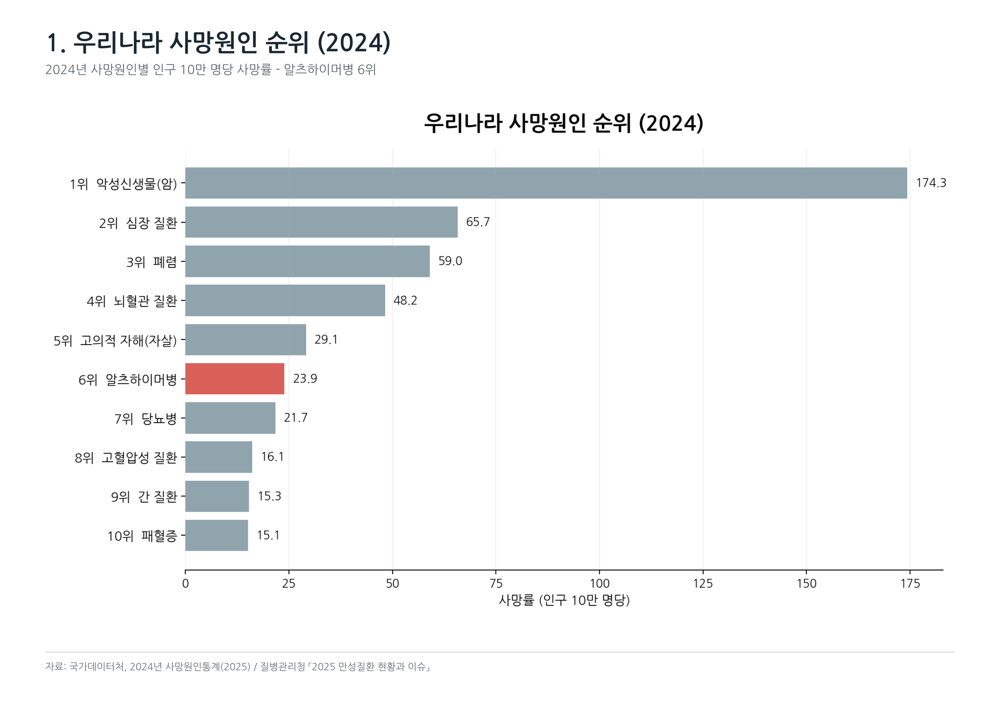

인구 10만 명당 사망률 기준, **알츠하이머병이 6위(23.9명)** — 암(1위, 174.3) · 심장질환(2위, 65.7) · 폐렴(3위, 59.0) · 뇌혈관질환(4위, 48.2) · 고의적 자해/자살(5위, 29.1)에 이어, 당뇨병(7위, 21.7)이나 고혈압성질환(8위, 16.1)보다도 높다. **"단순 노화 현상"이 아니라 실제 사망원인 상위권에 드는 질환**이라는 것을 가장 먼저 보여주는 근거다.

### 00-2. 주요 만성질환 사망률 추이 (2014·2023·2024)
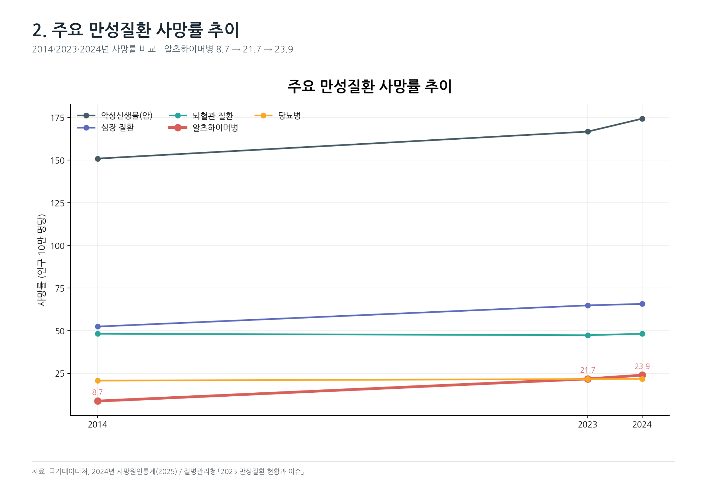

암(151.2→174.3)·심장질환(52.4→65.7) 등 다른 만성질환은 완만하게 오르는 반면, **알츠하이머병만 8.7 → 21.7 → 23.9로 10년 사이 거의 3배 가까이 뛰었다.** 절대 수치는 아직 암·심장질환보다 낮지만, 증가 속도 자체가 다른 질환과 다르다는 게 다음 차트(00-3)에서 더 뚜렷하게 드러난다.

### 00-3. 주요 만성질환 사망률 증감 추이 (2014년=0% 기준)
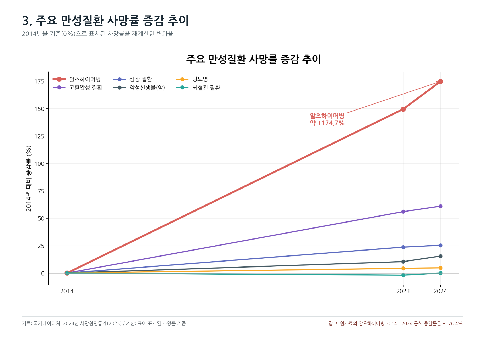

2014년 대비 증감률로 다시 그리면 차이가 명확해진다: **알츠하이머병 +174.7%(공식 통계 기준 +176.4%)** 로 압도적 1위이고, 그 다음이 고혈압성질환(+61%), 심장질환(+25%), 암(+15%), 당뇨병(+5%) 순이며 뇌혈관질환은 오히려 거의 변화가 없다(-2%). **다른 만성질환은 의료 발전·관리로 증가세가 둔화되는 동안, 치매만 유일하게 가파르게 악화되고 있다** — 이 프로젝트가 "왜 하필 지금, 왜 하필 치매인가"에 대한 가장 강한 한 장이다.

### 00-4. 주요 질환별 1인당 평균 내원일수 (2024)
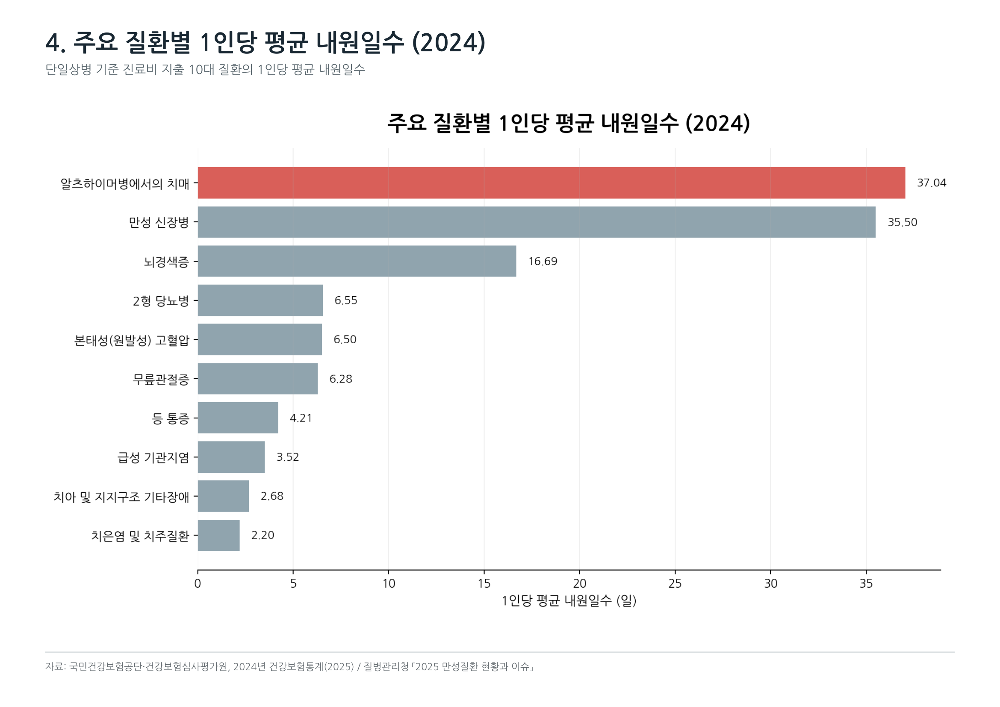

진료비 지출 상위 10대 질환 중 **알츠하이머병에서의 치매가 1인당 평균 내원일수 1위(37.04일)** — 만성신장병(35.50일), 뇌경색증(16.69일)보다도 많다. 당뇨병(6.55일)·고혈압(6.50일) 같은 흔한 만성질환의 5~6배 수준이다. **한 번 진단되면 얼마나 장기적·반복적인 관리가 필요한 질환인지**를 보여주는 근거다.

### 00-5. 주요 질환별 1인당 진료비 비교 (2024)
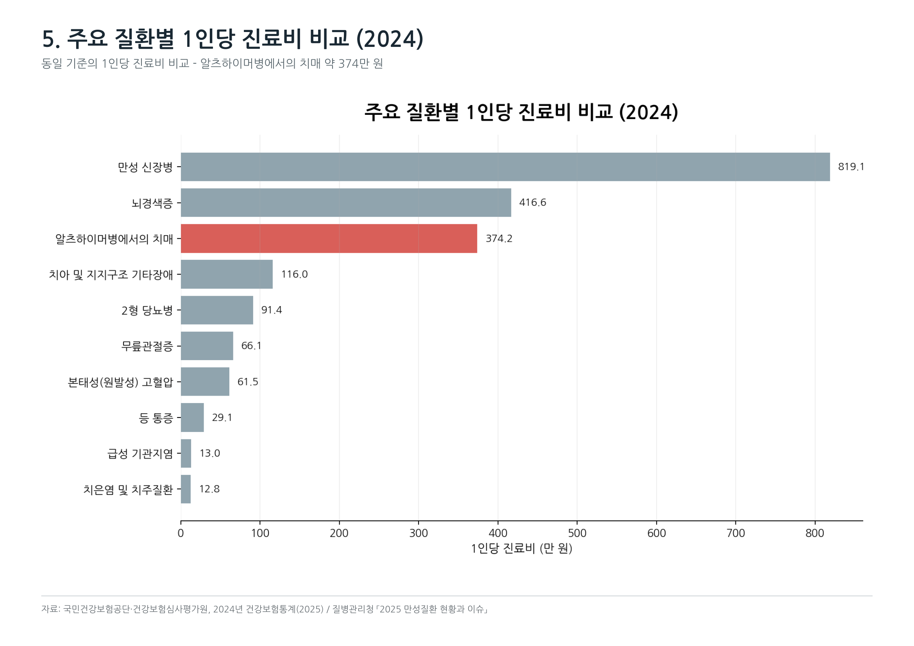

1인당 진료비는 만성신장병(819.1만 원)·뇌경색증(416.6만 원)에 이어 **알츠하이머병에서의 치매가 3위(374.2만 원)** 로, 당뇨병(91.4만 원)의 4배, 고혈압(61.5만 원)의 6배 수준이다. 01절 본문의 "환자 1인당 연간 관리비용 약 2,112만 원"(중앙치매센터, 돌봄·요양 등 포함 총비용)과는 집계 기준이 다른 **건강보험 진료비만의 수치**이므로, 발표에서 두 숫자를 같이 쓸 때는 "이건 진료비만, 저건 돌봄까지 포함한 총비용"이라고 구분해서 말해야 한다.

**빌드업 스토리라인 제안:** "00-1(사망원인 상위권) → 00-3(증가 속도 압도적 1위) → 00-4·00-5(장기·고비용 관리가 필요) → (여기서 기존 ②~⑦번으로 전환) 그런데 이 심각한 질환이 국내에서 구체적으로 어떻게 늘고 있고, 누가 더 위험한가?" 순으로 이어가면 "다른 병보다 왜 치매가 급한가"라는 의문을 먼저 해소하고 자연스럽게 치매 자체 통계로 넘어갈 수 있다.

---

## 1. 데이터셋 설명 (원본 위치: `raw_data_stats/`)

| 파일명 | 제공기관 | 기간 | 주요 컬럼 | 활용처 |
|---|---|---|---|---|
| `보건복지부_시군구별 치매현황_20251231.csv` | 보건복지부 | 2016~2025 | 연도/시도/시군구/성별/연령별/노인인구수/추정치매환자수/유병률/중증도/MCI 진단자수 | 시군구별 유병률 비교 (⑤번), 전국 평균 계산 |
| `보건복지부_치매환자 등록 현황_20241231.csv` | 보건복지부 | 2015~2024 | 연도/시도/남/여 | 성별 등록환자 추이 (②번), 독거노인 상관분석 (⑥번) |
| `보건복지부_독거노인 수_연령별_시도별_20241231.csv` | 보건복지부 | 2022~2024 | 연도/시도/연령대별 독거노인 수 | 위험요인(독거) 상관분석 (⑥번) |
| `건강보험심사평가원_시군구별 성별 치매질환 통계 2024.csv` | HIRA | 2024 | 시도/시군구/성별/환자수/입내원일수/요양급여비용 | 지역별 진료인원 (③번) |
| `건강보험심사평가원_시군구별 성별 연령별 치매질환 통계 2024.csv` | HIRA | 2024 | 시도/시군구/성별/연령구분/환자수 등 | 연령대별 분포 (④번) |
| `[별첨]2023년 치매역학조사 및 실태조사 주요 결과.pdf` | 보건복지부·중앙치매센터 | 2023 | 성별·연령별·지역별·가구유형별·교육수준별 유병률 원표 | 위험요인별 상세 수치 (⑦번) — 기획안 01절에서 "직접 확인 필요"로 남겼던 항목을 채워주는 자료 |
| `국민건강보험공단_*.csv` 2종 | 국민건강보험공단 | 2020~2024 | 상병코드별 진료인원(일부 `*` 마스킹) | 신뢰도 낮아 시각화에서 제외, 참고용으로만 보관 |
| `CustomExcelView.csv/.xlsx` | - | - | 항목명 코드북 | 실제 데이터 아님 — 컬럼 정의서(메타데이터) |

**전처리 참고사항**
- 보건복지부 시군구별 치매현황 데이터는 연도별로 연령 구간 표기 형식이 달라(`65세이상` vs `65 - 69세`) 정규화가 필요합니다.
- 2019년 데이터는 원본에 없습니다.
- 국민건강보험공단 상병코드 데이터는 소규모 인원 마스킹(`*`)으로 신뢰도가 낮아 이번 시각화에서는 제외했습니다.

---

## 2. 시각화 결과 (총 6개, ②~⑦ — ①번은 검수 후 삭제)

> **① 전국 유병률 추이(2016~2025) 차트는 삭제했습니다.** 9년간 치매 9.0%→9.2%, MCI 27.9%→28.1%로 사실상 변화가 없어 "추이"로 보여주면 오히려 심각성이 죽는 역효과가 있고, 같은 유병률 수치(9.25%/28.42%)는 기획안 01절에 이미 확보돼 있어 중복이었습니다.

### ② 성별 등록 치매환자수 추이 (2015~2024)
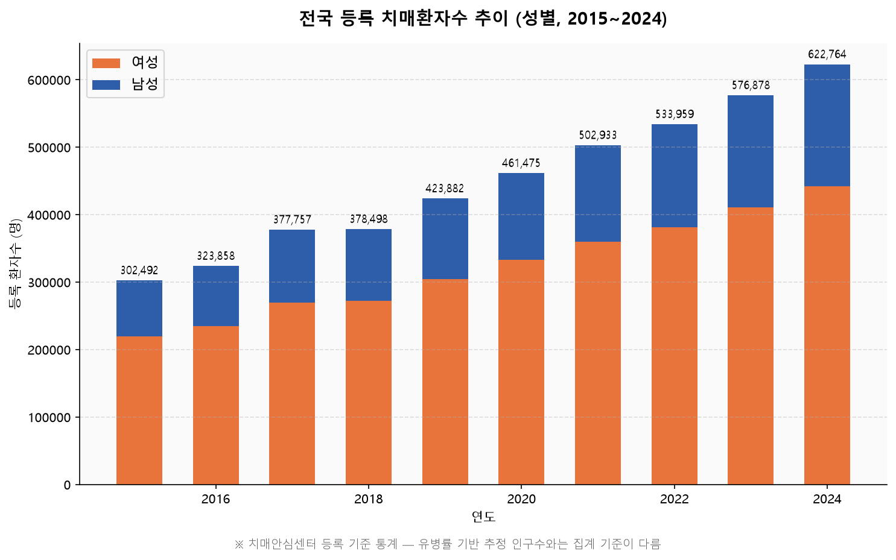

등록 치매환자는 2015년 약 30만 명에서 2024년 62만 명으로 큰 폭으로 증가했습니다. **여성 환자 비율이 71~73%로 압도적으로 높습니다.**

**주의**: 이 숫자는 "치매안심센터 등록" 기준 행정통계입니다. 기획안 01절의 "2025년 약 97만 명"은 유병률×인구로 산출한 **추정치**로 집계 기준이 다릅니다. 발표에서 두 숫자를 같이 쓸 때는 기준 차이를 각주로 밝혀야 합니다(차트에 각주 추가함).

### ③ 시도별 치매 진료인원 (2024년)
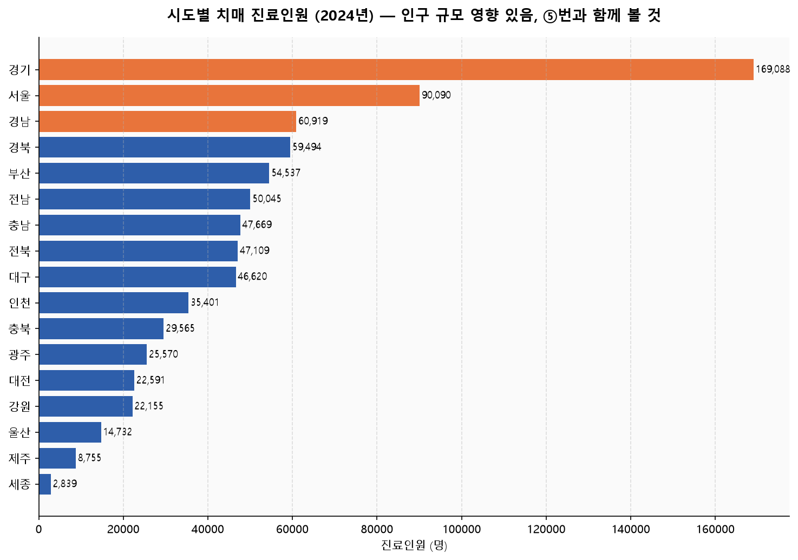

경기·서울·경남 순으로 진료인원이 많지만, 이는 인구 규모가 큰 지역이 자연히 상위를 차지하는 결과입니다. 인구 대비 비율(유병률) 관점의 ⑤번 차트와 반드시 함께 봐야 지역별 실질 위험도를 오해하지 않습니다.

### ④ 연령대·성별 치매 진료인원 분포 (2024년)
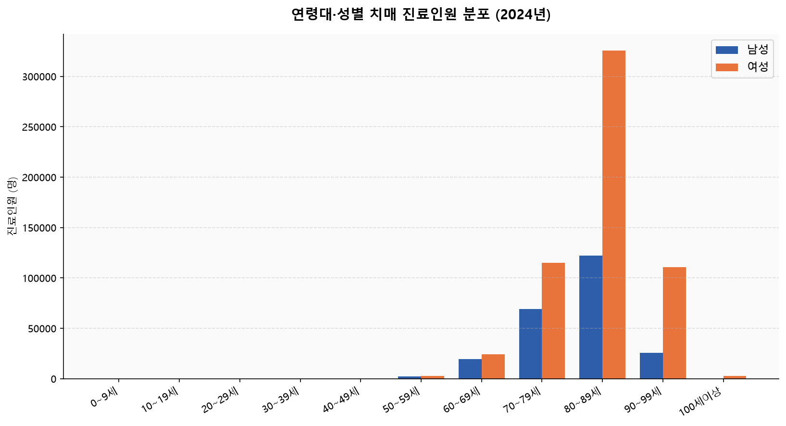

80~89세 구간에서 여성 환자 수(약 32만 명)가 남성(약 12만 명)의 2.6배에 달합니다. 60대부터 증가가 시작되어 80대에 정점을 찍는 전형적인 노년기 질환 패턴입니다.

### ⑤ 65세 이상 치매 유병률 상위 10개 시군구 (2024년)
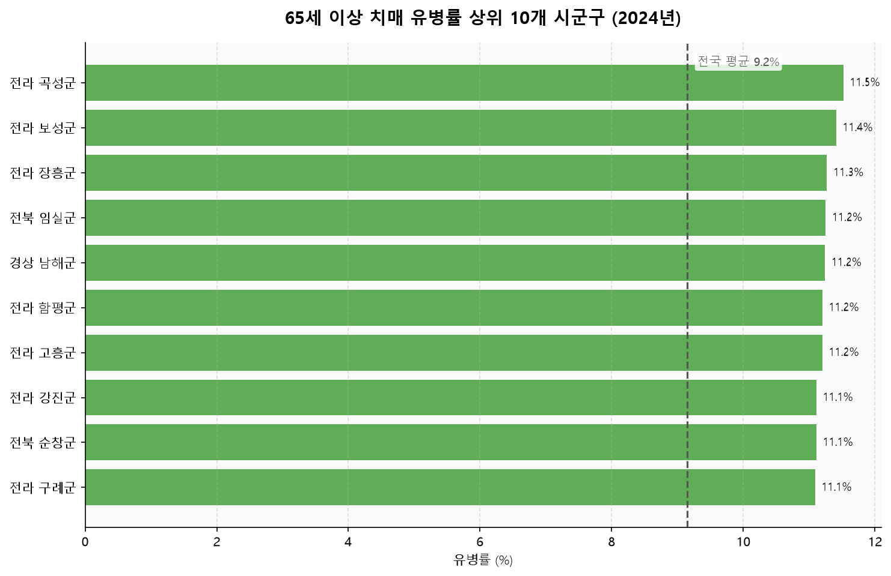

10개 지역이 11.1~11.5%로 서로 비슷해 보일 수 있어 **전국 평균(9.15%) 기준선을 차트에 추가**했습니다. 대도시 대신 **농어촌·고령화가 심한 지역**(전라·전북·경남 일부)이 상위권을 차지합니다.

### ⑥ 시도별 독거노인 수 – 치매 등록환자수 관계 (2024년)
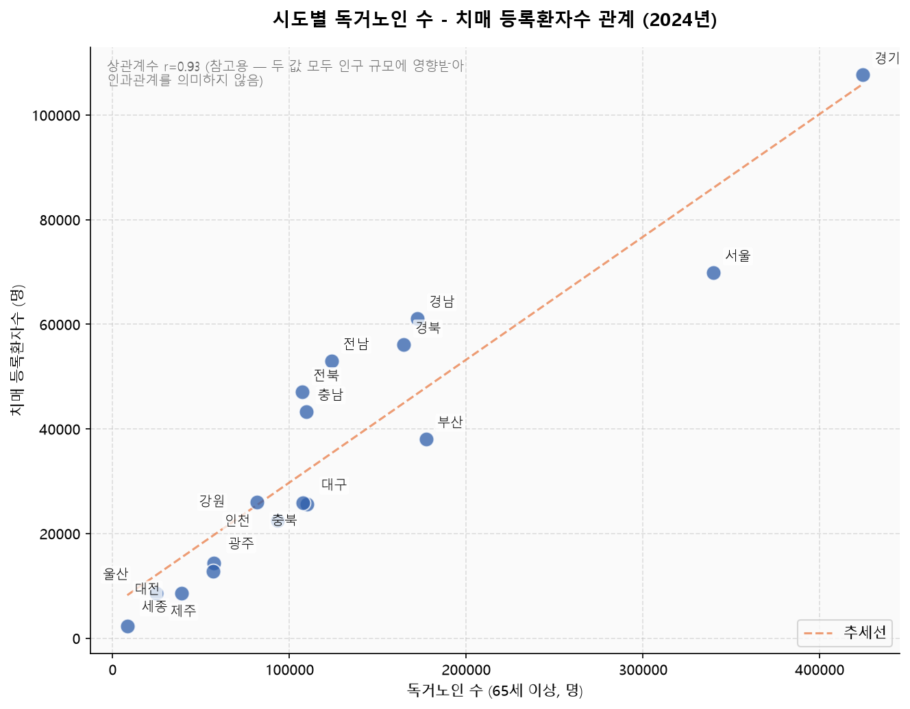

상관계수 r=0.93이지만, 독거노인 수와 치매 등록환자수 둘 다 "그 지역 인구가 얼마나 많은가"에 좌우되므로 대부분 **인구 규모 효과**일 가능성이 높습니다. 제목에서 상관계수를 빼고 차트 안에 "인과관계 아님" caveat를 직접 표시했습니다. "독거가 위험요인"이라는 기존 역학연구를 뒷받침하는 정황 증거 정도로만 쓰고, 발표에서 단정적 근거로 내세우지 않는 것을 권합니다. 라벨 겹침 문제(충북/강원/광주/대전/제주/울산/세종 근처)도 4방향으로 흩어 붙이도록 고쳤습니다.

### ⑦ 치매 고위험군 — 인구·사회학적 요인별 유병률 (2023년 치매역학조사)
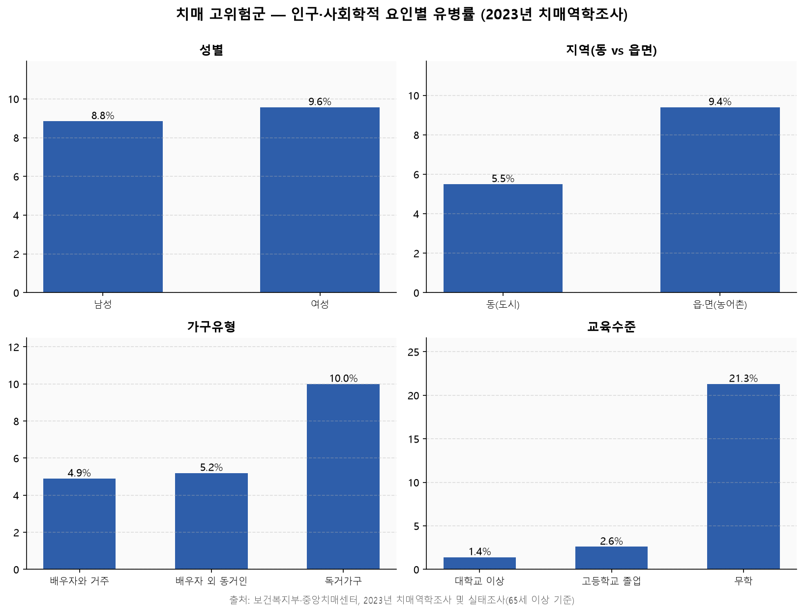

기획안 01절에서 "직접 확인 필요"로 남겨뒀던 정확한 수치를 **보건복지부·중앙치매센터 원본 보고서**에서 그대로 인용했습니다.

- 성별: 여성 9.57% > 남성 8.85%
- 지역: 읍·면(농어촌) 9.4% > 동(도시) 5.5%
- 가구유형: 독거가구 10.0% > 배우자 외 동거인 5.2% > 배우자와 거주 4.9%
- 교육수준: 무학 21.3% > 고졸 2.6% > 대졸 이상 1.4% (**격차가 가장 큼**)

교육수준 격차(21.3% vs 1.4%, 약 15배)가 다른 요인보다 압도적으로 커서, 발표에서 가장 강한 임팩트를 줄 수 있는 수치입니다.

---

## 3. 발표 활용 제안

**"0절(다른 만성질환과 비교해 왜 치매가 유독 심각한가) → ② 증가추이 → ③④⑤ 위험집단·지역 특성 → ⑥⑦ 위험요인(⑦이 핵심 근거, ⑥은 참고용)"** 순서로 배치하면 자연스러운 빌드업 스토리라인이 됩니다. 0절이 "왜 하필 치매인가"라는 도입 질문에 먼저 답해주므로, 곧바로 ②번(치매 자체의 증가 추이)로 넘어가도 어색하지 않습니다. ③번(진료인원)과 ⑤번(유병률)은 반드시 붙여서 "인원 수 1위 지역≠위험도 1위 지역"이라는 점을 같이 설명해야 오해가 없습니다. ⑦번은 01절 "고령·여성·농촌·독거·저학력일수록 위험" 주장의 직접적인 수치 근거이므로 문제의식 파트의 클라이맥스로 쓰기 좋습니다.

## 4. 다음 단계 제안
- 치매안심센터 표준데이터(위경도)와 ⑤번 상위 지역을 겹쳐 "고위험 지역 대비 센터 밀도" 분석 추가
- 노인인구수 대비 정규화한 "인구 10만 명당 진료인원" 지표로 ③번 차트 보완
- ⑥번은 가능하면 독거노인 비율 vs 치매 등록률(둘 다 인구 대비 정규화)로 재분석하면 인구 규모 효과 논란 없이 쓸 수 있음

## 5. 코드 안내

생성 코드는 `analysis/02_public_stats_visualization.py`에 있습니다. `pandas` + `matplotlib`만 사용하고, `BASE`(원본 CSV 경로 = `raw_data_stats/`)와 `OUT`(저장 경로 = 이 폴더)만 맞으면 그대로 재실행됩니다.

- 공공데이터는 대부분 `cp949(EUC-KR)` 인코딩이라 `utf-8`로 읽으면 에러가 납니다.
- ⑤번은 `연령별` 컬럼 표기가 연도마다 달라(`65세이상` vs `65 - 69세`) 정규화 후 필터링합니다.
- ⑥번은 `pd.merge()`로 두 데이터셋을 시도명 기준 결합 → `np.polyfit()` 추세선, `.corr()` 상관계수.
- ⑦번은 CSV가 아니라 보고서 원표를 그대로 인용하므로 코드에 하드코딩되어 있습니다(출처: `raw_data_stats/보건복지부/[별첨]2023년 치매역학조사...pdf`).
